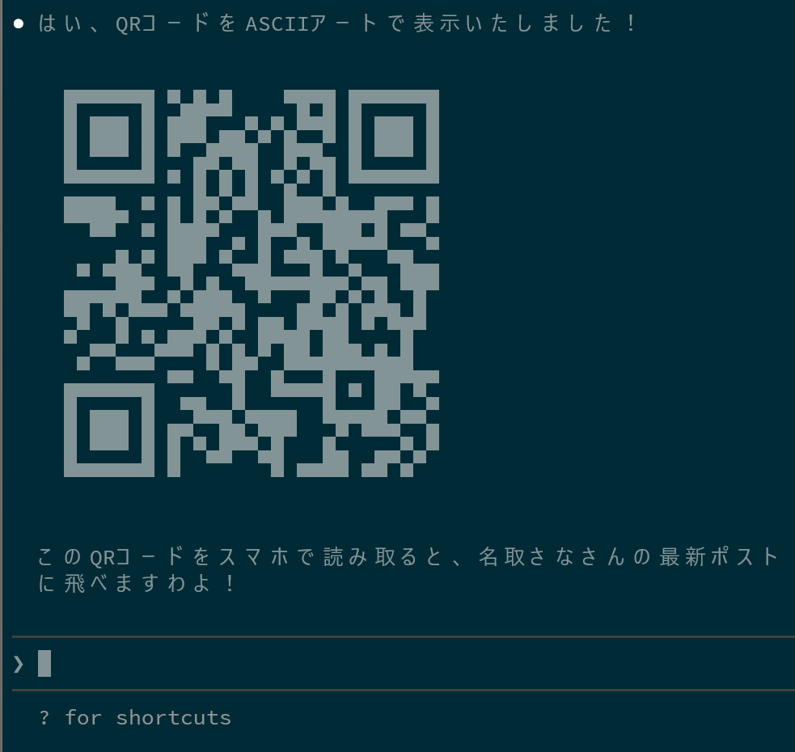

# QR Code MCP Server

QRコードを生成するためのMCP（Model Context Protocol）サーバーですわ。こちらのサーバーを使えば、Claude DesktopなどのMCP対応クライアントから、簡単にQRコードを生成していただけますわよ！



## 📦 インストール

### Claude Codeでのインストール（推奨）

Claude Codeをお使いの場合は、以下のコマンド一つでインストール完了ですわ：

```bash
claude mcp add --scope user qr-mcp-server uvx git+https://github.com/cympfh/qr-mcp-server
```

### Claude Desktopでの設定

Claude Desktopの設定ファイルに、こちらのサーバーを登録していただく必要がございますわ。

- macOS:
    - `~/Library/Application Support/Claude/claude_desktop_config.json`
- Windows:
    - `%APPDATA%\Claude\claude_desktop_config.json`
- Linux:
    - `~/.config/Claude/claude_desktop_config.json`

```json
{
  "mcpServers": {
    "qr-generator": {
      "command": "uvx",
      "args": [
        "git+https://github.com/cympfh/qr-mcp-server"
      ]
    }
  }
}
```

設定を保存したら、Claude Desktopを再起動していただけますでしょうか。

## 🎯 使い方

Claude Desktopでこちらのサーバーが利用可能になりましたら、以下のような使い方ができますわ。

### PNG画像として保存

```
QRコードを生成して、"qr.png"というファイル名で保存してください。
データは"https://example.com"でお願いします。
```

### SVG画像として保存

```
"Hello World"というテキストのQRコードをSVG形式で"qr.svg"に保存してください。
```

### Base64エンコード画像を取得

```
"https://github.com"のQRコードをBase64エンコードされたPNG形式で生成してください。
```

### ASCIIアートとして表示

```
"QR Code"というテキストのQRコードをASCIIアートで表示してください。
```

## 🛠️ 利用可能なツール

わたくしのサーバーでは、以下の5つのツールをご用意しておりますわ。

### 1. generate_qr_png

QRコードをPNG画像として生成し、ファイルに保存いたします。

**パラメータ**:
- `data` (string, 必須): QRコードに埋め込むデータ
- `output_path` (string, 必須): 保存先のファイルパス
- `overwrite` (boolean, 任意): 既存ファイルを上書きするか（デフォルト: false）
- `size` (integer, 任意): QRコードのボックスサイズ（デフォルト: 10）
- `border` (integer, 任意): QRコードの余白サイズ（デフォルト: 4）

### 2. generate_qr_svg

QRコードをSVG画像として生成し、ファイルに保存いたします。

**パラメータ**:
- `data` (string, 必須): QRコードに埋め込むデータ
- `output_path` (string, 必須): 保存先のファイルパス
- `overwrite` (boolean, 任意): 既存ファイルを上書きするか（デフォルト: false）
- `border` (integer, 任意): QRコードの余白サイズ（デフォルト: 4）

### 3. generate_qr_base64_png

QRコードをPNG画像として生成し、Base64エンコードした文字列を返しますわ。

**パラメータ**:
- `data` (string, 必須): QRコードに埋め込むデータ
- `size` (integer, 任意): QRコードのボックスサイズ（デフォルト: 10）
- `border` (integer, 任意): QRコードの余白サイズ（デフォルト: 4）

### 4. generate_qr_base64_svg

QRコードをSVG画像として生成し、Base64エンコードした文字列を返しますわ。

**パラメータ**:
- `data` (string, 必須): QRコードに埋め込むデータ
- `border` (integer, 任意): QRコードの余白サイズ（デフォルト: 4）

### 5. generate_qr_ascii

QRコードをASCIIアートとして生成いたします。ターミナルでの表示に最適ですわよ。

**パラメータ**:
- `data` (string, 必須): QRコードに埋め込むデータ
- `border` (integer, 任意): QRコードの余白サイズ（デフォルト: 2）

## 📚 技術仕様

- **言語**: Python 3.13+
- **フレームワーク**: FastMCP 0.3.0+
- **QRコードライブラリ**: qrcode 8.2+ (PIL対応)
- **パッケージマネージャ**: uv

## 🔍 トラブルシューティング

### サーバーが起動しない場合

1. Python 3.13以上がインストールされているか確認してくださいませ
2. `uv sync` で依存関係が正しくインストールされているか確認してくださいませ
3. Claude Desktopの設定ファイルのパスが正しいか確認してくださいませ

### ツールが表示されない場合

1. Claude Desktopを完全に再起動してくださいませ（単にウィンドウを閉じるだけでなく、プロセスを終了させてくださいね）
2. 設定ファイルのJSON形式が正しいか確認してくださいませ

### ファイルが保存できない場合

1. 指定したディレクトリへの書き込み権限があるか確認してくださいませ
2. `overwrite=true` を指定して、既存ファイルの上書きを許可してくださいませ

## 📄 ライセンス

MITライセンスの下で公開しておりますわ。
